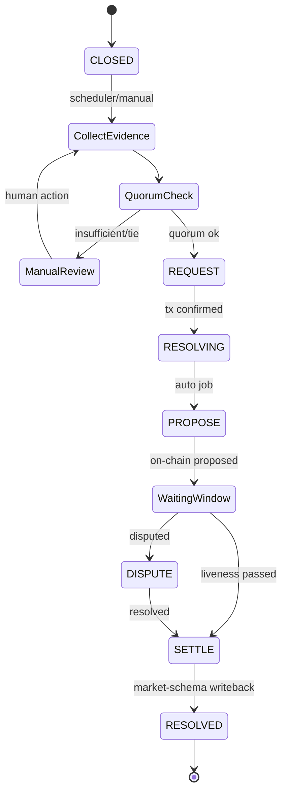

# predix-oracle-ops

PrediX Oracle Ops — evidence collection, UMA propose/dispute/settle orchestration, and market resolution sync (Polymarket-style: **on-chain UMA result is final**).

## Quick start

### Local (Maven)

```bash
# 1) Start infra
docker compose up -d postgres redis rabbitmq

# 2) Run app
export ORACLE_ADMIN_TOKEN=dev-admin-token
mvn spring-boot:run
```

App: http://localhost:8085  
Swagger: http://localhost:8085/swagger-ui.html  
Health: http://localhost:8085/actuator/health

### Docker (all-in-one)

```bash
docker compose up --build
```

## API examples

```bash
# List sources
curl http://localhost:8085/api/v1/oracle/sources

# Create source (admin token required)
curl -X POST http://localhost:8085/api/v1/oracle/sources \
  -H "Content-Type: application/json" \
  -H "X-Oracle-Admin-Token: dev-admin-token" \
  -d '{"name":"feed-1","baseUrl":"https://api.example.com/outcome","priority":10}'

# Collect evidence
curl -X POST "http://localhost:8085/api/v1/oracle/evidences/collect?marketId=mkt-001" \
  -H "X-Oracle-Admin-Token: dev-admin-token"

# Trigger UMA request
curl -X POST "http://localhost:8085/api/v1/oracle/jobs/trigger/request?marketId=mkt-001" \
  -H "X-Oracle-Admin-Token: dev-admin-token"

# Retry failed job
curl -X POST http://localhost:8085/api/v1/oracle/jobs/1/retry \
  -H "X-Oracle-Admin-Token: dev-admin-token"
```

Unified response:

```json
{
  "code": "OK",
  "message": "Success",
  "data": {},
  "traceId": "...",
  "timestamp": "2026-05-20T00:00:00Z"
}
```

## Resolution flow (Mermaid)



## Evidence model

| Field | Description |
|-------|-------------|
| source_name / source_id | Registered oracle source |
| source_url | Exact fetched URL |
| fetched_at | UTC fetch time |
| raw_payload | Immutable JSON evidence (jsonb) |
| normalized_outcome_code | Canonical outcome |
| confidence_score | Optional BigDecimal weight |
| hash_digest | SHA-256 digest for integrity |

Aggregation: **majority quorum** across enabled sources (`min-sources` + `quorum-ratio`). Ties or insufficient sources → `requiresManualReview`.

## Failure, retry & manual intervention

- Jobs are **idempotent** via `marketId:JOB_TYPE` keys (+ Redis consume dedupe).
- Failures use **exponential backoff** (`base-delay-ms`, `multiplier`, `max-attempts`).
- Exhausted retries → **DLQ** queue `predix.oracle.dlq`.
- Manual APIs: `/jobs/{id}/retry`, `/jobs/trigger/*` (audited, token-protected).

## Tests

```bash
mvn test
mvn verify jacoco:report   # coverage report in target/site/jacoco
```

## Docs

- [architecture.md](docs/architecture.md)
- [resolution-flow.md](docs/resolution-flow.md)
- [evidence-policy.md](docs/evidence-policy.md)

## Downstream services

| Service | Purpose |
|---------|---------|
| predix-market-schema | Market status & resolve writeback |
| predix-matching-engine | Trading halt / resolution events (optional) |
| blockchain-lottery-java-event-indexer | On-chain event reconciliation (optional) |
| Polygon RPC | UMA OO reads/writes when `UMA_ENABLED=true` |
